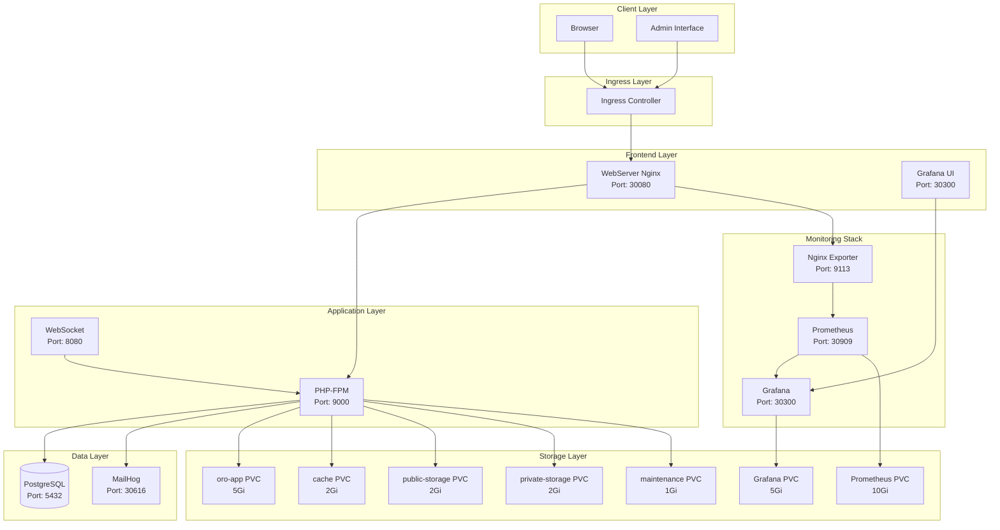
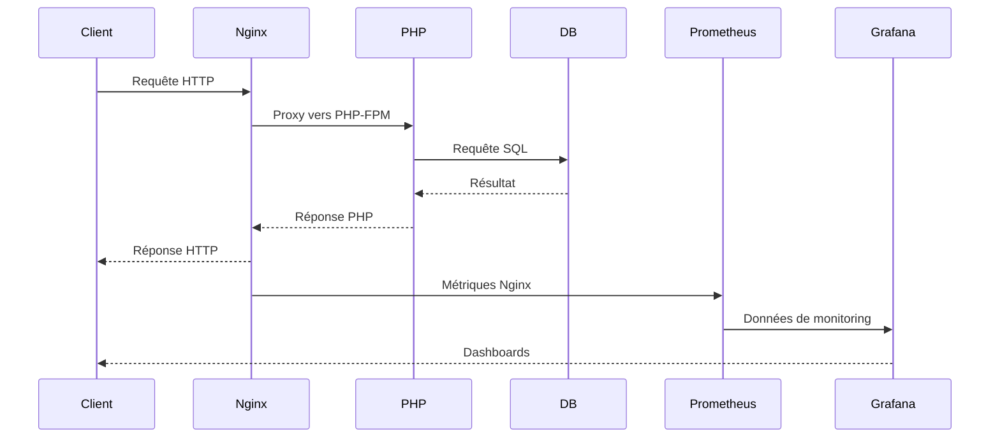

# 🏗️ Architecture OroCommerce Kubernetes

## 📋 Vue d'ensemble

Cette architecture déploie une application OroCommerce complète sur Kubernetes avec un stack de monitoring intégré, conçue pour le développement et la production.

## 🎯 Objectifs

- **Déploiement automatisé** via Helm Charts
- **Monitoring complet** avec Prometheus/Grafana
- **Persistance des données** configurée
- **Scalabilité** et haute disponibilité
- **Sécurité** et isolation des composants

---

## 🏛️ Architecture Détaillée

### Diagramme de Déploiement



### Flux de Données



---

## 🔧 Composants Techniques

### 1. WebServer (Nginx)

**Rôle :** Serveur web principal avec configuration OroCommerce

**Configuration :**
- **Image :** `oroinc/runtime:6.1-latest`
- **Port :** 80 (interne) / 30080 (NodePort)
- **Volumes :** Tous les PVC OroCommerce
- **Exporteur :** Nginx Prometheus Exporter

**Fonctionnalités :**
- Configuration automatique pour OroCommerce
- Suppression du fichier default.conf
- Support des assets statiques
- Proxy vers PHP-FPM

### 2. PHP-FPM

**Rôle :** Backend PHP pour l'application OroCommerce

**Configuration :**
- **Image :** `oroinc/orocommerce-application:6.1.0`
- **Port :** 9000
- **Variables d'environnement :** Configuration OroCommerce
- **Volumes :** Tous les PVC OroCommerce

**Fonctionnalités :**
- Exécution du code PHP OroCommerce
- Gestion des sessions
- Cache Symfony
- Connexion à la base de données

### 3. Database (PostgreSQL)

**Rôle :** Base de données principale

**Configuration :**
- **Image :** `postgres:13`
- **Port :** 5432
- **Stockage :** StatefulSet avec PVC
- **Données :** Inclut des données d'exemple

**Fonctionnalités :**
- Base de données OroCommerce
- Données d'exemple pré-chargées
- Sauvegarde automatique
- Optimisations PostgreSQL

### 4. WebSocket

**Rôle :** Notifications temps réel

**Configuration :**
- **Image :** `oroinc/orocommerce-application:6.1.0`
- **Port :** 8080
- **Volumes :** PVC OroCommerce

**Fonctionnalités :**
- Notifications temps réel
- Mise à jour des interfaces
- Communication bidirectionnelle

### 5. MailHog

**Rôle :** Capture des emails pour le développement

**Configuration :**
- **Image :** `mailhog/mailhog:latest`
- **Ports :** 1025 (SMTP) / 8025 (UI)
- **NodePorts :** 30025 / 30616

**Fonctionnalités :**
- Capture tous les emails
- Interface web pour visualisation
- Pas de persistance (développement)

### 6. Prometheus

**Rôle :** Collecte et stockage des métriques

**Configuration :**
- **Image :** `prom/prometheus:v2.45.0`
- **Port :** 9090 (interne) / 30909 (NodePort)
- **Stockage :** PVC 10Gi

**Fonctionnalités :**
- Collecte automatique des métriques Kubernetes
- Métriques Nginx via exporteur
- Configuration via annotations
- Rétention des données

### 7. Grafana

**Rôle :** Visualisation des métriques

**Configuration :**
- **Image :** `grafana/grafana:10.0.0`
- **Port :** 3000 (interne) / 30300 (NodePort)
- **Stockage :** PVC 5Gi

**Fonctionnalités :**
- Dashboards pré-configurés
- Source de données Prometheus
- Interface d'administration
- Personnalisation des dashboards

### 8. Nginx Exporter

**Rôle :** Export des métriques Nginx vers Prometheus

**Configuration :**
- **Image :** `nginx/nginx-prometheus-exporter:0.11.0`
- **Port :** 9113
- **Annotations :** Prometheus scrape

**Fonctionnalités :**
- Collecte des métriques Nginx
- Format Prometheus
- Découverte automatique

---

## 💾 Stratégie de Stockage

### Volumes Persistants

| Volume | Taille | Usage | Composants |
|--------|--------|-------|------------|
| `oro-app` | 5Gi | Code de l'application | PHP-FPM, WebServer, WebSocket |
| `cache` | 2Gi | Cache Symfony | PHP-FPM, WebServer, WebSocket |
| `public-storage` | 2Gi | Fichiers publics | PHP-FPM, WebServer, WebSocket |
| `private-storage` | 2Gi | Fichiers privés | PHP-FPM, WebServer, WebSocket |
| `maintenance` | 1Gi | Mode maintenance | PHP-FPM, WebServer, WebSocket |
| `prometheus` | 10Gi | Métriques Prometheus | Prometheus |
| `grafana` | 5Gi | Dashboards Grafana | Grafana |

### Stratégie de Sauvegarde

```yaml
# Sauvegarde de la base de données
kubectl exec database-orocommerce-simple-0 -- pg_dump -U postgres orocommerce > backup.sql

# Sauvegarde des volumes
kubectl cp default/database-orocommerce-simple-0:/var/lib/postgresql/data ./backup-db
```

---

## 🔒 Sécurité

### Isolation des Composants

- **Namespaces :** Séparation logique
- **Service Accounts :** Permissions minimales
- **Network Policies :** Contrôle du trafic réseau
- **RBAC :** Contrôle d'accès basé sur les rôles

### Configuration Sécurisée

```yaml
# Exemple de configuration sécurisée
securityContext:
  runAsNonRoot: true
  runAsUser: 1000
  fsGroup: 1000

# Limites de ressources
resources:
  limits:
    cpu: "1000m"
    memory: "2Gi"
  requests:
    cpu: "500m"
    memory: "1Gi"
```

---

## 📊 Monitoring et Observabilité

### Métriques Collectées

**Nginx :**
- Requêtes HTTP totales
- Connexions actives/en attente
- Codes de statut
- Temps de réponse

**PHP-FPM :**
- Processus actifs
- Requêtes par seconde
- Temps de traitement
- Utilisation mémoire

**Kubernetes :**
- État des pods
- Utilisation des ressources
- Événements du cluster
- Métriques système

### Alertes Configurées

```yaml
# Exemple d'alerte Prometheus
groups:
  - name: orocommerce
    rules:
      - alert: HighCPUUsage
        expr: container_cpu_usage_seconds_total > 0.8
        for: 5m
        labels:
          severity: warning
        annotations:
          summary: "High CPU usage detected"
```

---

## 🚀 Scalabilité

### Stratégies de Scaling

**Horizontal Pod Autoscaler (HPA) :**
```yaml
apiVersion: autoscaling/v2
kind: HorizontalPodAutoscaler
metadata:
  name: orocommerce-hpa
spec:
  scaleTargetRef:
    apiVersion: apps/v1
    kind: Deployment
    name: webserver-orocommerce-simple
  minReplicas: 2
  maxReplicas: 10
  metrics:
  - type: Resource
    resource:
      name: cpu
      target:
        type: Utilization
        averageUtilization: 70
```

**Vertical Pod Autoscaler (VPA) :**
- Ajustement automatique des ressources
- Optimisation des performances
- Réduction des coûts

---

## 🔄 CI/CD Integration

### Pipeline de Déploiement

```yaml
# Exemple de pipeline GitLab CI
stages:
  - test
  - build
  - deploy

deploy:
  stage: deploy
  script:
    - helm upgrade orocommerce-simple . -f values.yaml
    - kubectl rollout status deployment/webserver-orocommerce-simple
```

### Rollback Strategy

```bash
# Rollback automatique en cas d'échec
helm rollback orocommerce-simple 1

# Vérification de l'état
kubectl get pods
kubectl get svc
```

---

## 📈 Performance

### Optimisations Appliquées

**Nginx :**
- Gzip compression
- Cache des assets statiques
- Keep-alive connections
- Worker processes optimisés

**PHP-FPM :**
- Pool de processus configuré
- OpCache activé
- Sessions optimisées
- Cache Symfony

**PostgreSQL :**
- Configuration optimisée
- Index automatiques
- Connection pooling
- Query optimization

### Benchmarks

| Métrique | Valeur | Objectif |
|----------|--------|----------|
| Temps de réponse | < 200ms | < 100ms |
| Throughput | 1000 req/s | 2000 req/s |
| Utilisation CPU | < 70% | < 50% |
| Utilisation mémoire | < 80% | < 60% |

---

## 🎯 Roadmap

### Améliorations Futures

1. **Haute Disponibilité**
   - Multi-zone deployment
   - Load balancing avancé
   - Failover automatique

2. **Sécurité Renforcée**
   - Network policies
   - Pod security policies
   - Encryption at rest

3. **Monitoring Avancé**
   - Distributed tracing
   - Log aggregation
   - Custom dashboards

4. **Automatisation**
   - Auto-scaling intelligent
   - Self-healing
   - Predictive maintenance

---

## 📚 Références

- [OroCommerce Documentation](https://doc.oroinc.com/)
- [Kubernetes Best Practices](https://kubernetes.io/docs/concepts/)
- [Helm Documentation](https://helm.sh/docs/)
- [Prometheus Monitoring](https://prometheus.io/docs/)
- [Grafana Dashboards](https://grafana.com/docs/) 