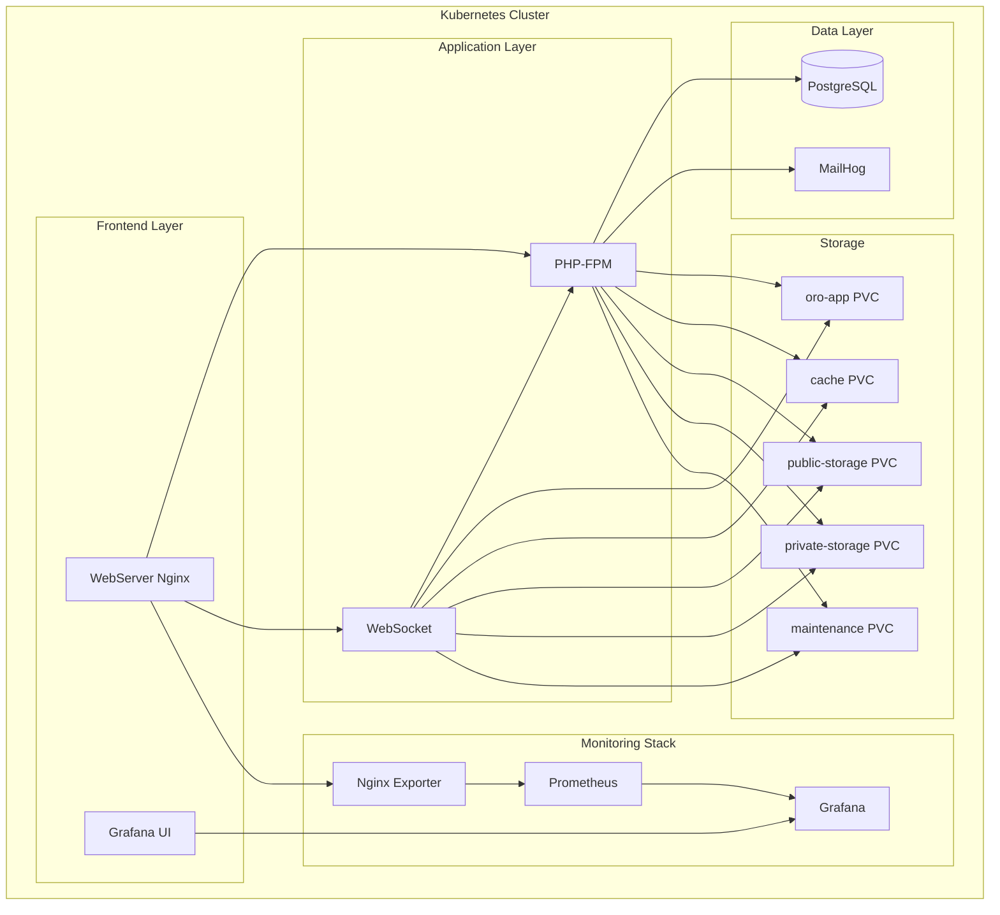

# 🚀 OroCommerce Kubernetes - Livrable Complet

## 📋 Table des matières

1. [Architecture](#architecture)
2. [Infrastructure](#infrastructure)
3. [Installation](#installation)
4. [Monitoring](#monitoring)
5. [Documentation](#documentation)
6. [Dépannage](#dépannage)

---

## 🏗️ Architecture

### Vue d'ensemble
Cette solution déploie une application OroCommerce complète sur Kubernetes avec monitoring intégré.



### Composants

| Composant | Description | Port | Type |
|-----------|-------------|------|------|
| **WebServer** | Nginx avec configuration OroCommerce | 30080 | NodePort |
| **PHP-FPM** | Backend PHP pour OroCommerce | 9000 | ClusterIP |
| **Database** | PostgreSQL avec données d'exemple | 5432 | ClusterIP |
| **WebSocket** | Notifications temps réel | 8080 | ClusterIP |
| **MailHog UI** | Interface web MailHog | 30616 | NodePort |
| **MailHog SMTP** | Serveur SMTP MailHog | 30025 | NodePort |
| **Prometheus** | Collecte de métriques | 30909 | NodePort |
| **Grafana** | Dashboards de monitoring | 30300 | NodePort |
| **Nginx Exporter** | Métriques Nginx | 9113 | ClusterIP |

---

## 🏛️ Infrastructure

### ✅ Helm Charts Complets

**Chart Principal :** `orocommerce-simple`
- **Version :** 0.1.0
- **Dépendances :** 7 sous-charts
- **Configuration :** Modularisée et conditionnelle

**Sous-charts :**
1. **webserver** - Serveur web Nginx avec exporteur de métriques
2. **database** - Base de données PostgreSQL
3. **php-fpm** - Backend PHP-FPM
4. **websocket** - Service WebSocket
5. **mail** - Service MailHog
6. **prometheus** - Collecte de métriques
7. **grafana** - Visualisation des dashboards

### ✅ Monitoring Intégré

**Prometheus :**
- Collecte automatique des métriques Kubernetes
- Métriques Nginx via exporteur dédié
- Configuration via annotations de pods
- Stockage persistant (10Gi)

**Grafana :**
- Dashboards pré-configurés
- Source de données Prometheus automatique
- Interface d'administration sécurisée
- Stockage persistant (5Gi)

### ✅ Persistance des Données

**Volumes persistants :**
- `oro-app` : 5Gi - Code de l'application
- `cache` : 2Gi - Cache Symfony
- `public-storage` : 2Gi - Fichiers publics
- `private-storage` : 2Gi - Fichiers privés
- `maintenance` : 1Gi - Mode maintenance

---

## 🚀 Installation

### Prérequis
- Kubernetes cluster (Docker Desktop, Minikube, etc.)
- Helm 3.x
- kubectl configuré

### Installation ONE TAP
```bash
# 1. Cloner le repository
git clone <repository-url>
cd kube/orocommerce-simple

# 2. Installation complète
helm install orocommerce-simple . -f values.yaml

# 3. Attendre que tous les pods soient Running
kubectl get pods -w
```

### Vérification
```bash
# Vérifier les services
kubectl get svc

# Vérifier les pods
kubectl get pods

# Vérifier les volumes persistants
kubectl get pvc
```

---

## 🌐 Accès aux Services

### Accès Direct via NodePort (Recommandé)

Tous les services sont accessibles directement via leurs NodePorts :

| Service | URL | Identifiants |
|---------|-----|--------------|
| **OroCommerce** | `http://oro.demo:30080` | `admin/admin` |
| **Admin** | `http://oro.demo:30080/admin` | `admin/admin` |
| **Prometheus** | `http://localhost:30909` | - |
| **Grafana** | `http://localhost:30300` | `admin/admin` |
| **MailHog UI** | `http://localhost:30616` | - |
| **MailHog SMTP** | `localhost:30025` | - |

### Configuration du fichier hosts

Pour accéder à OroCommerce via `oro.demo:30080`, ajoutez cette ligne dans votre fichier hosts :

**Windows :** `C:\Windows\System32\drivers\etc\hosts`  
**Linux/Mac :** `/etc/hosts`

```
127.0.0.1 oro.demo
```

**Alternative avec localhost :**
Si vous ne voulez pas modifier le fichier hosts, utilisez `http://localhost:30080` à la place.

### Port-Forward (Alternative pour développement)

Si vous préférez utiliser les port-forward (optionnel) :

```bash
# Terminal 1 - OroCommerce
kubectl port-forward svc/webserver-orocommerce-simple 8080:80

# Terminal 2 - Prometheus
kubectl port-forward svc/orocommerce-simple-prometheus 9090:9090

# Terminal 3 - Grafana
kubectl port-forward svc/orocommerce-simple-grafana 3000:3000

# Terminal 4 - Exporteur Nginx (optionnel)
kubectl port-forward svc/webserver-orocommerce-simple-nginx-exporter 9113:9113

# Terminal 5 - MailHog
kubectl port-forward svc/orocommerce-simple-mail-ui 8025:8025
```

**⚠️ Important :** Gardez les terminaux de port-forward ouverts pendant que vous utilisez les services. Fermer un terminal arrêtera le port-forward correspondant.

### Accès via Port-Forward
| Service | URL | Identifiants |
|---------|-----|--------------|
| **OroCommerce** | `http://localhost:8080` | `admin/admin` |
| **Admin** | `http://localhost:8080/admin` | `admin/admin` |
| **Prometheus** | `http://localhost:9090` | - |
| **Grafana** | `http://localhost:3000` | `admin/admin` |
| **MailHog UI** | `http://localhost:8025` | - |

---

## 📊 Monitoring

### Métriques Disponibles

**Nginx :**
- `nginx_http_requests_total` - Nombre total de requêtes
- `nginx_http_connections_active` - Connexions actives
- `nginx_http_connections_reading` - Connexions en lecture
- `nginx_http_connections_writing` - Connexions en écriture
- `nginx_http_connections_waiting` - Connexions en attente

**Kubernetes :**
- `up` - État des services
- `kubernetes_pod_status_phase` - État des pods
- `container_memory_usage_bytes` - Utilisation mémoire
- `container_cpu_usage_seconds_total` - Utilisation CPU

### Requêtes PromQL Exemples
```promql
# Taux de requêtes Nginx
rate(nginx_http_requests_total[5m])

# Connexions actives
nginx_http_connections_active

# État des pods OroCommerce
up{job="orocommerce-pods"}

# Utilisation mémoire
container_memory_usage_bytes{container="webserver"}
```

### Dashboards Grafana
1. **Kubernetes Cluster Monitoring** - Métriques du cluster
2. **Node Exporter Full** - Métriques système
3. **OroCommerce Custom** - Métriques spécifiques (à créer)

---

## 📚 Documentation

### Fichiers de Documentation
- **README-INSTALLATION.md** - Guide d'installation détaillé
- **MONITORING.md** - Configuration du monitoring
- **values.yaml** - Configuration par défaut
- **values-production.yaml** - Configuration de production

### Configuration Avancée

**Personnalisation des ressources :**
```yaml
webserver:
  resources:
    limits:
      cpu: "1000m"
      memory: "2Gi"
    requests:
      cpu: "500m"
      memory: "1Gi"
```

**Activation/désactivation de composants :**
```yaml
prometheus:
  enabled: true  # ou false

grafana:
  enabled: true  # ou false
```

---

## 🐛 Dépannage

### Problèmes Courants

**1. Pods en CrashLoopBackOff**
```bash
# Vérifier les logs
kubectl logs <pod-name>

# Redémarrer le pod
kubectl delete pod <pod-name>
```

**2. Services non accessibles**
```bash
# Vérifier les services
kubectl get svc

# Vérifier les endpoints
kubectl get endpoints
```

**3. Problèmes de persistance**
```bash
# Vérifier les PVC
kubectl get pvc

# Vérifier les PV
kubectl get pv
```

**4. Monitoring non fonctionnel**
```bash
# Vérifier l'exporteur Nginx
kubectl logs -l app=webserver-exporter

# Vérifier Prometheus
kubectl logs -l app=prometheus-orocommerce-simple
```

### Logs Utiles
```bash
# Logs du webserver
kubectl logs -l app=webserver-orocommerce-simple

# Logs PHP-FPM
kubectl logs -l app=php-fpm-orocommerce-simple

# Logs de la base de données
kubectl logs -l app=database-orocommerce-simple
```

---

## 🔧 Maintenance

### Mise à jour
```bash
# Mettre à jour le chart
helm upgrade orocommerce-simple . -f values.yaml
```

### Sauvegarde
```bash
# Sauvegarder la base de données
kubectl exec database-orocommerce-simple-0 -- pg_dump -U postgres orocommerce > backup.sql
```

### Nettoyage
```bash
# Désinstallation complète
helm uninstall orocommerce-simple
kubectl delete pvc --all
```

---

## 📈 Métriques de Performance

### Ressources Recommandées
- **CPU :** 4 cores minimum
- **RAM :** 8GB minimum
- **Stockage :** 20GB minimum

### Optimisations
- Activation du cache Redis (optionnel)
- Configuration des limites de ressources
- Optimisation des requêtes PostgreSQL
- Mise en cache des assets statiques

---

## 🎯 Conclusion

Cette solution fournit une infrastructure Kubernetes complète pour OroCommerce avec :

✅ **Helm Charts complets** et modulaires  
✅ **Monitoring intégré** avec Prometheus/Grafana  
✅ **Persistance des données** configurée  
✅ **Documentation détaillée** et guides de dépannage  
✅ **Installation ONE TAP** sans intervention manuelle  
✅ **Configuration flexible** pour développement et production  

**Prêt pour la production** avec quelques ajustements de sécurité et de performance. 